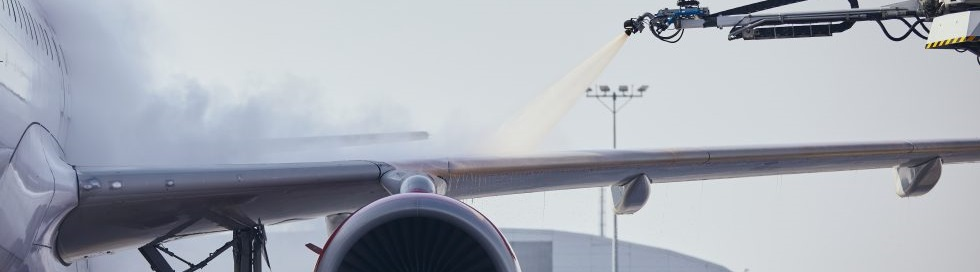

# [US Income Analysis](ex0525_ANALYSIS.pdf)
- **Introduction**: As a data scientist, Duy is requested to query a subset of the incomes of Americans. This subset consists of Americans and their distributions of annual incomes in five different education categories (less than 12 years, 12 years, 13-15 years, 16 years, and more than 16 years) with a certain classified condition in 2005.
- **What's In The Data**: It contains 12,000+ rows, each depicting a person with two features, where one feature consists of the five education categories, and the other consists of their income. The subset can be seen in [ex0525.csv](data/ex0525.csv).
- **Assumptions**: Appropriate assumptions are established in preparation for Analysis of Variance (ANOVA) testing by visualizing before and after logarithmic transformation.
- **Problem Statements**: The addressed problem statements are as follows:
  - **1**. Test if at least one of the five distributions of educated people is different from the other distributions. This is a necessary step prior to pairwise comparisons.
  - **2**. Test if people with a Bachelors (16 years of education) have different distributions of income than people with graduate-level education (more than 16 years of education) using an Extra Sum of Squares Test.
  - **3**. Test if at least one of the five distributions of educated people is different from the other distributions, but assumes that there is no equal standard deviation for the logged data. Using Welch's ANOVA Test is most appropriate for this task, since it does not assume equal variance.
  - **4**. Determine which pairs of education category distributions differ and by how much money or percentage using the Tukey-Kramer test.
  - **5**. Test if there is a difference in income distributions between people with high school education (12 years) versus the other education categories using Dunnett's Test.

# [IceMelt.csv Analysis Summary (click for full report)](ex0525_ANALYSIS.pdf)
- **Introduction**: In preparation for the next Texas deadly winter storm like [this one in February 2022](https://en.wikipedia.org/wiki/February_2022_North_American_winter_storm), an undisclosed major airline allocated extra resources for the data science department, where Duy is tasked to test the effectiveness of chemicals used for airplane de-icing. The major airline made a prior experiment dedicating to this task using Calcium, Magnesium, Potassium, and Sodium (which are recorded as one feature of the resulting data), and timed the number of seconds it took to completely de-ice a single airplane wing (which was recorded as another feature).
- **What's In The Data**: The resulting data contains 166 rows, each depicting a randomly chosen airplane recorded for the two features mentioned previously. The data can be seen in [IceMelt.csv](data/IceMelt.csv).
- **Assumptions**: Since this experiment was done on a random sample of airplanes which are all in the same environment and conditions, it is safe to say that any analyses can be generalized to the overall population of airplanes. However, the randomized assignment of jets for de-icing was not mentioned, there any causal inferences cannot be made.
- 
